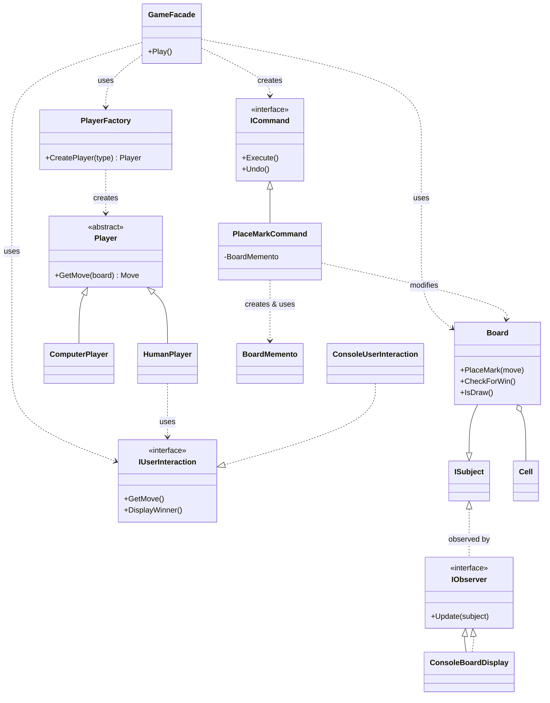

# Tic-Tac-Toe: A Study in Software Design Patterns

This project implements the classic game of Tic-Tac-Toe, but with a strong emphasis on software architecture and design patterns. It serves as a practical example of how to apply Gang of Four (GoF) patterns and SOLID principles to build a system that is robust, extensible, and maintainable, even for a simple problem domain.

This project was developed with the assistance of an AI assistant to accelerate development and explore modern coding practices.

## Educational Goals

The primary purpose of this repository is not just to create a playable game, but to showcase and document the application of key software engineering concepts. It is intended for developers who want to see a practical implementation of:

-   **Clean Architecture:** Separating concerns into distinct layers.
-   **SOLID Principles:** Building a foundation for maintainable and scalable software.
-   **GoF Design Patterns:** Using proven solutions for common software design problems.
-   **Test-Driven Development (TDD):** Ensuring code quality and reliability through comprehensive testing.

## Architectural Overview

The solution follows the principles of **Clean Architecture**, dividing the codebase into three main projects:

-   `TicTacToeGoF.Core`: Contains the core business logic, domain models, and abstractions. It has no dependencies on any specific UI or framework.
-   `TicTacToeGoF.UI`: A console-based user interface that depends on the Core project. It is responsible for all user interactions and rendering the game state.
-   `TicTacToeGoF.Tests`: Contains unit and integration tests for the Core project, ensuring the logic is correct and reliable.

This separation ensures that the core game logic is independent of its presentation, making it easy to swap the console UI for a web or desktop UI in the future.

## Design Patterns Implemented

This project leverages several GoF design patterns to manage complexity and promote loose coupling.

### Class Diagram Overview

The following diagram illustrates the relationships between the key components and the patterns they implement.



### Pattern Descriptions

1.  **Facade:** The `GameFacade` class provides a simple, unified interface to the complex subsystems of the game (player management, game loop, command history). The UI layer interacts only with this facade, simplifying its job.

2.  **Factory Method:** The `PlayerFactory` class is responsible for creating `Player` objects (`HumanPlayer` or `ComputerPlayer`). This decouples the game logic from the concrete player classes, making it easy to add new player types without changing the core game flow.

3.  **Observer:** The `Board` acts as the `Subject`, and UI components like `ConsoleBoardDisplay` act as `Observers`. Whenever the board's state changes (e.g., a mark is placed), it notifies all observers, who then update themselves to reflect the new state. This keeps the UI synchronized with the game state without tight coupling.

4.  **Command:** The `PlaceMarkCommand` encapsulates a request to place a mark on the board. The `GameFacade` creates and executes these commands, storing them in a stack. This pattern is key to implementing the undo functionality, as each command knows how to reverse its own action.

5.  **Memento:** The `Board` can create a `BoardMemento` object that stores a snapshot of its internal state (the grid of symbols). The `PlaceMarkCommand` uses this memento to save the board's state *before* executing a move. If an `Undo` is requested, the command uses the memento to restore the board to its previous state.

6.  **Singleton:** The `Board` is implemented as a Singleton to ensure there is only one instance of the game board throughout the application. This is kept for educational purposes to demonstrate the pattern, though in larger applications, managing such state via Dependency Injection is often preferred.

## How to Run the Project

1.  Clone the repository.
2.  Open the solution in Visual Studio or your preferred .NET IDE.
3.  Set `TicTacToeGoF.UI` as the startup project.
4.  Run the application.

You can also run the application from the command line:

```bash
# Navigate to the UI project directory
cd TicTacToeGoF.UI

# Run the application
dotnet run
```
